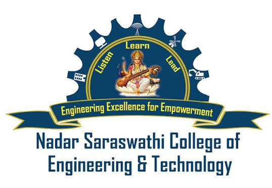
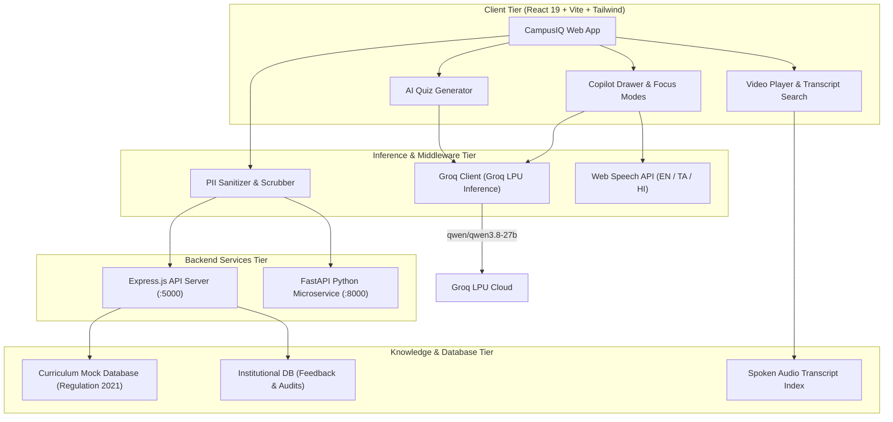

<div align="center">

  

  # 🎓 CampusIQ
  ### Institutional Intelligence, AI Copilot & Video Learning Hub
  **Nadar Saraswathi College of Engineering & Technology (NSCET), Theni, Tamil Nadu**  
  *Affiliated to Anna University, Chennai • Approved by AICTE, New Delhi • Accredited by NAAC*

  <br />

  [](https://www.annauniv.edu/)
  [](https://groq.com/)
  [](https://react.dev/)
  [](https://www.typescriptlang.org/)
  [](https://tailwindcss.com/)
  [](https://vitejs.dev/)

  <br />

  [Explore Features](#-key-features) •
  [Architecture](#-system-architecture) •
  [Curriculum Tracks](#-curriculum-domains--video-vault) •
  [Getting Started](#-quick-start) •
  [Role Portals](#-role-based-dashboards) •
  [Contributing](#-contributing)

</div>

---

## 🌟 Executive Overview

**CampusIQ** is a purpose-built, high-assurance campus academic operating system designed for **Nadar Saraswathi College of Engineering & Technology (NSCET Theni)**. Grounded strictly in **Anna University Regulation 2021** curricula, CampusIQ unites three mission-critical capabilities into a single cohesive, lightning-fast platform:

1. 🧠 **Grounded RAG Copilot (Groq LPU Inference)**: High-speed bilingual academic assistant providing Part-A (2-Mark) and Part-B (16-Mark) exam-calibrated explanations with zero hallucinations.
2. 📺 **Curated YouTube Learning Hub**: 16 categorized engineering lectures mapped unit-by-unit with deep spoken audio transcript search and synchronized classroom note-taking.
3. ⚡ **AI Exam Quiz Generator Studio**: Synthesizes syllabus-grounded self-assessment practice quizzes on demand with real-time countdown timers, interactive question ribbons, and printable scorecards.
4. 🛡️ **Privacy-Preserving Closed-Loop Student Voice**: 100% anonymous feedback engine with automated dual-layer PII redaction and an auditable 7-stage administrative resolution pipeline.

---

## 📑 Interactive Table of Contents

<details open>
<summary><b>Click to expand navigation</b></summary>

- [✨ Key Features](#-key-features)
  - [1. CampusIQ Grounded AI Copilot](#1-campusiq-grounded-ai-copilot)
  - [2. YouTube Academic Learning Hub & Player](#2-youtube-academic-learning-hub--player)
  - [3. AI Exam Quiz Generator Studio](#3-ai-exam-quiz-generator-studio)
  - [4. Closed-Loop Student Voice & PII Sanitizer](#4-closed-loop-student-voice--pii-sanitizer)
- [🏛️ Curriculum Domains & Video Vault](#-curriculum-domains--video-vault)
- [🏗️ System Architecture](#-system-architecture)
- [👥 Role-Based Dashboards](#-role-based-dashboards)
- [🚀 Quick Start & Installation](#-quick-start)
  - [Prerequisites](#prerequisites)
  - [Step-by-Step Setup](#step-by-step-setup)
  - [Environment Variables](#environment-variables)
- [📂 Project Directory Structure](#-project-directory-structure)
- [🔐 Security, Ethics & Anti-Hallucination Guardrails](#-security-ethics--anti-hallucination-guardrails)
- [📜 Institutional Attribution & Accreditation](#-institutional-attribution--accreditation)

</details>

---

## ✨ Key Features

### 1. CampusIQ Grounded AI Copilot
*Powered by Groq LPUs running `qwen/qwen3.8-27b` with fallback to `openai/gpt-oss-120b`*

- **Focus Mode Filters**:
  - 🎓 **2M & 16M Exam Prep**: Calibrated specifically for Anna University examiners with definition formulas, key points, and structural rubrics.
  - 💻 **Code & Algorithms**: Code tracing with formal time ($O(N), O(\log N)$) and space complexity breakdowns.
  - 🏛️ **Campus & Labs**: Verified answers on NSCET computer lab configurations, transport routes, and campus circulars.
- **Interactive Message Controls**:
  - 👍 / 👎 Instant feedback sentiment ratings.
  - 🔊 Web Speech synthesis supporting English, Tamil (தமிழ்), and Hindi (हिन्दी).
  - 📋 1-Click clean Markdown code copying.
  - ✨ **"Quiz Me" Shortcut**: Prompts Copilot to instantly generate a 3-question drill on whatever concept was just explained.
- **Export Chat**: Download the entire conversation as a Markdown (`.md`) study revision document with 1 click.

---

### 2. YouTube Academic Learning Hub & Player
*Curated Anna University Regulation 2021 video lectures with deep transcript intelligence*

- **Multi-Track Categorized Shelves View**:
  - Automatically sorts lectures into 5 curriculum domains with total watch times and lecture counts.
- **3-Way View Layout**:
  - 📂 **Categorized Shelves View** (Default structured domain shelves)
  - 🔲 **Grid View** (3-column responsive card grid)
  - 🌳 **Syllabus Hierarchy View** (Anna University Unit 1 through Unit 5 sequence)
- **🎙️ Spoken Transcript Deep Search**:
  - Indexes all spoken words in audio tracks; typing queries like `"BCNF"` or `"Round Robin"` reveals exact audio timestamps with direct `[14:20] Click to Seek ➜` links.
- **3-in-1 Classroom Studio Player (`/student/videos/:id`)**:
  - **Tab 1: Spoken Transcript**: Real-time transcript feed with seek and "Ask AI" buttons.
  - **Tab 2: Student Notes**: Interactive personal notes tagged with the current playback timestamp (e.g. `[21:20]`).
  - **Tab 3: AI Exam Revision Kit**: 1-Click Part-A & Part-B model question generator.
  - **NBA Criterion 3 Accreditation Card**: Displays Course Outcome (CO) and Program Outcome (PO) mapping.

---

### 3. AI Exam Quiz Generator Studio
*Interactive self-assessment engine strictly aligned with Bloom's Taxonomy*

```
Student Configures: Course Code + Unit (1-5) + Difficulty + Language (EN/TA)
                                ↓
        Groq LPU Synthesizes Question Bank with Concept Rationales
                                ↓
            Interactive Exam Studio Launches (Timer + Ribbon)
                                ↓
    Scorecard Generated (Distinction Badges + Print Summary + "Ask Copilot")
```

- **Live Countdown Timer**: Allocates 1 minute per question with a pulsing red warning under 60 seconds.
- **Question Navigator Ribbon**: Interactive numbered pills (`Q1`, `Q2`, `Q3`...) showing Answered, Current, and Unanswered states.
- **Post-Submission Conceptual Review**:
  - Highlights correct options in green and mistakes in rose.
  - Displays full Anna University concept explanations.
  - 1-Click **"Ask Copilot to explain"** hook for personalized AI tutoring.
  - Performance badges: **🏆 Distinction (80%+)**, **🥈 Good Effort (50%+)**, or **📘 Revision Advised**.
  - **Print Official Scorecard**: Formatted with NSCET header for physical record-keeping.

---

### 4. Closed-Loop Student Voice & PII Sanitizer
*Empowering student expression while safeguarding student privacy*

- **Dual-Layer PII Scrubber**: Automatically scrubs student roll numbers (e.g. `921022104001`), mobile numbers, and personal identifiers before storage.
- **7-Stage Resolution Workflow**:
  ```
  [1. Submitted] ➔ [2. PII Sanitized] ➔ [3. AI Triaged] ➔ [4. HOD Review]
                                                                ↓
  [7. Action Closed] 🠔 [6. In Progress] 🠔 [5. Principal Approved]
  ```
- **Real-Time PII Shield Indicator**: Confirms `✓ PII Check Passed (100% Anonymous)` directly in the modal UI as the user types.

---

## 🏛️ Curriculum Domains & Video Vault

CampusIQ features **16 full-length curriculum video lectures** totaling **9 hours 21 minutes** of instructional material taught by NSCET faculty:

| Domain Specialization | Code | Subject Title | Unit | Faculty | Duration |
| :--- | :--- | :--- | :---: | :--- | :---: |
| 💻 **Core Software & Algorithms** | `CS3351` | Database Management Systems (1NF-BCNF) | 3 | Dr. S. Karthik | 35:40 |
| 💻 **Core Software & Algorithms** | `CS3401` | Algorithms: Dynamic Programming & Shortest Paths | 3 | Prof. K. Sundar | 36:00 |
| 💻 **Core Software & Algorithms** | `CS3301` | Data Structures: AVL Tree Rotations (LL, RR, LR, RL) | 4 | Prof. K. Sundar | 33:00 |
| 💻 **Core Software & Algorithms** | `CS3391` | OOP Java: Multithreading & Synchronization | 3 | Dr. M. Deepa | 29:00 |
| 💻 **Core Software & Algorithms** | `CS3452` | Theory of Computation: DFA Design & Minimization | 2 | Prof. P. Ramasamy | 32:00 |
| 💻 **Core Software & Algorithms** | `CS3501` | Compiler Design: Lexical Analysis & LL(1) Parsing | 2 | Dr. S. Karthik | 41:00 |
| 🛡️ **Systems, Networks & Security** | `CS3451` | Operating Systems: CPU Scheduling & Gantt Charts | 2 | Dr. M. Deepa | 30:20 |
| 🛡️ **Systems, Networks & Security** | `CS3491` | Cryptography: RSA Public Key Cryptosystem | 3 | Dr. S. Karthik | 38:00 |
| 🛡️ **Systems, Networks & Security** | `CS3591` | Computer Networks: Distance Vector & Dijkstra | 3 | Prof. K. Sundar | 35:00 |
| 🛡️ **Systems, Networks & Security** | `CCS335` | Cloud Computing: Virtualization, AWS & Docker | 2 | Dr. M. Deepa | 37:00 |
| 🧠 **AI & Data Science** | `AI3401` | Deep Learning: MLP & Backpropagation Derivation | 2 | Dr. R. Meenakshi | 41:00 |
| 🧠 **AI & Data Science** | `AI3402` | Machine Learning: Support Vector Machines & Kernels | 4 | Dr. R. Meenakshi | 40:00 |
| 🧠 **AI & Data Science** | `AD3501` | Deep Learning for Vision: CNNs, ResNet & Transfer Learning | 3 | Dr. R. Meenakshi | 42:00 |
| ⚡ **Electronics & Embedded** | `CS3691` | Embedded Systems & IoT: ARM Cortex & GPIO in C | 1 | Prof. P. Ramasamy | 31:00 |
| ⚡ **Electronics & Embedded** | `EC3352` | Digital Systems Design: K-Maps, Logic & Verilog | 1 | Dr. V. Selvam | 33:00 |
| 📐 **Foundations & Python** | `GE3151` | Problem Solving & Python: Control Structures & Functions | 1 | Er. S. Anitha | 27:00 |

---

## 🏗️ System Architecture



---

## 👥 Role-Based Dashboards

CampusIQ tailors its navigation and capabilities across 4 distinct institutional roles:

| Role | Access Route | Key Capabilities |
| :--- | :--- | :--- |
| **Student** | `/student/dashboard` | Learning Hub, AI Quiz Studio, Bookmarks, Lecture Watch History, Anonymous Grievances, AI Assistant |
| **Faculty** | `/faculty/dashboard` | Course Content Uploads, Lecture Engagement Analytics, Student Performance Drills, Syllabus Coverage |
| **HOD** | `/hod/dashboard` | Department Feedback Analytics, Resolution Approvals, NBA Accreditation Reports with `window.print()` |
| **Admin** | `/admin/dashboard` | Closed-Loop Resolution Stepper, User Management, Content Moderation, Security Audit Logs |

---

## 🚀 Quick Start

### Prerequisites
- **Node.js**: v18.0 or higher
- **npm** or **pnpm**
- **Git**

### Step-by-Step Setup

```bash
# 1. Clone the repository
git clone https://github.com/chellamuthukumar001/NSCET_FIST.git
cd NSCET_FIST

# 2. Install dependencies
npm install

# 3. Configure environment variables
cp .env.example .env

# 4. Start the development server
npm run dev
```

Open your browser and navigate to: **`http://localhost:5173`**

### Backend Services (Optional for Local API Emulation)

```bash
# Start Express.js server
cd backend
npm install
npm run dev

# Start FastAPI Python microservice (in a separate terminal)
cd ../fastapi_service
pip install -r requirements.txt
uvicorn main:app --reload --port 8000
```

### Environment Variables

Create a `.env` file in the root directory:

```env
# Groq LPU Inference API Key
VITE_GROQ_API_KEY=your_groq_api_key_here

# Groq Model Selection
VITE_GROQ_MODEL=qwen/qwen3.8-27b
```

---

## 📂 Project Directory Structure

```
NSCET_FIST/
├── public/                     # Static institutional brand assets & images
│   ├── assets/
│   │   ├── campus/             # Campus photography (aerial, blocks, sports)
│   │   ├── nscet-college-logo.jpg # Official NSCET College Crest Logo
│   │   ├── campusiq-logo.png   # CampusIQ emblem
│   │   └── fist-cse-logo.png   # FIST CSE Department Emblem
├── src/
│   ├── components/
│   │   ├── common/             # Reusable UI components (ConfidenceBadge, GlassCard)
│   │   ├── copilot/            # Copilot drawer, VoiceQueryModal, focus modes
│   │   ├── feedback/           # Anonymous FeedbackModal with live PII check
│   │   ├── layout/             # AppHeader, AppSidebar, PublicNavbar, MobileBottomNav
│   │   └── video/              # VideoCard, LectureQuizModal, ExamRevisionModal, TranscriptViewer
│   ├── context/                # React Contexts (AuthContext, CopilotContext, Notifications)
│   ├── lib/                    # Core libraries
│   │   ├── groqClient.ts       # Groq LPU API client integration
│   │   ├── quizGenerator.ts    # AI Quiz synthesizer & curriculum fallback banks
│   │   ├── mockDatabase.ts     # 16 video modules, faculty, departments & transcripts
│   │   ├── piiScrubber.ts      # Client-side PII sanitization engine
│   │   └── voiceAssistant.ts   # Speech recognition & synthesis controller
│   ├── pages/                  # Role-based page views
│   │   ├── student/            # LearningHubPage, StudentQuizPage, VideoDetailPage, Assistant
│   │   ├── faculty/            # FacultyDashboard, Courses, Analytics
│   │   ├── hod/                # HodDashboard, Feedback, Reports
│   │   ├── admin/              # AdminDashboard, ClosedLoop, Audit
│   │   └── public/             # HomePage, AboutPage, CoursesPage, LoginPage
│   ├── types/                  # TypeScript domain models (Video, QuizQuestion, Feedback)
│   ├── App.tsx                 # Client router & navigation scaffolding
│   └── main.tsx                # React application entry point
├── backend/                    # Express.js backend API controllers & SQLite schema
├── fastapi_service/            # Python FastAPI microservice for embeddings & vector search
├── .env.example                # Environment configuration template
├── vite.config.ts              # Vite bundler build configuration
└── package.json                # Project dependencies & npm scripts
```

---

## 🔐 Security, Ethics & Anti-Hallucination Guardrails

1. **Zero-Hallucination Threshold**: When query confidence drops below verifiable syllabus bounds, Copilot states its limitation and directs students to official NSCET coordinators.
2. **Untrusted Context Isolation**: User input strings are strictly sanitized before prompting LLM inference.
3. **Autonomous PII Sanitization**: Feedback submissions are purged of roll numbers and phone numbers before hitting the database or AI inference pipeline.
4. **Push Protection Compliant**: API keys and secrets are abstracted using environment variables to maintain repository hygiene.

---

## 📜 Institutional Attribution & Accreditation

Developed for **Nadar Saraswathi College of Engineering & Technology (NSCET)**  
*Vadapudupatti, Theni District - 625531, Tamil Nadu, India*  
Department of Computer Science & Engineering (FIST)  
Curriculum Compliance: **Anna University, Chennai (Regulation 2021)**

---

<div align="center">
  <sub>Engineered with precision for student excellence • Built with React, Vite, Tailwind CSS & Groq LPU Inference</sub>
</div>
